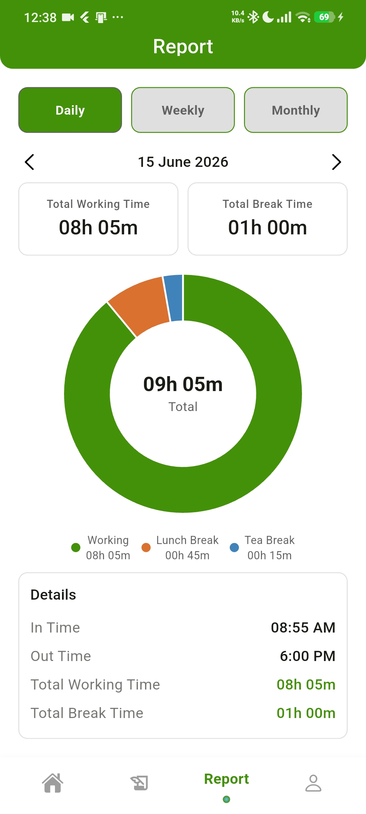
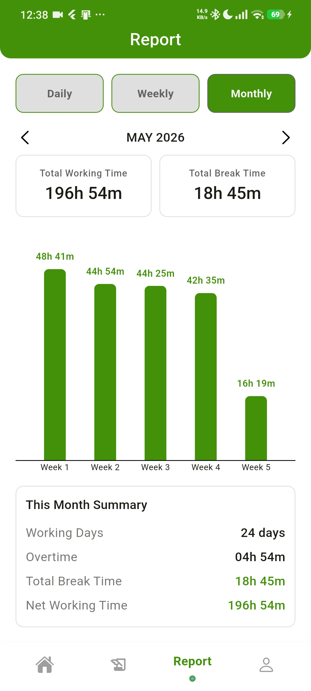
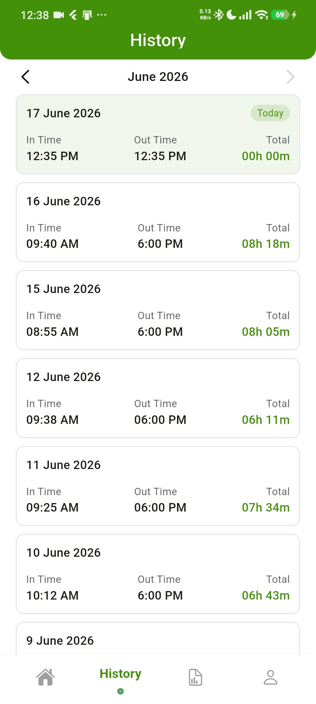
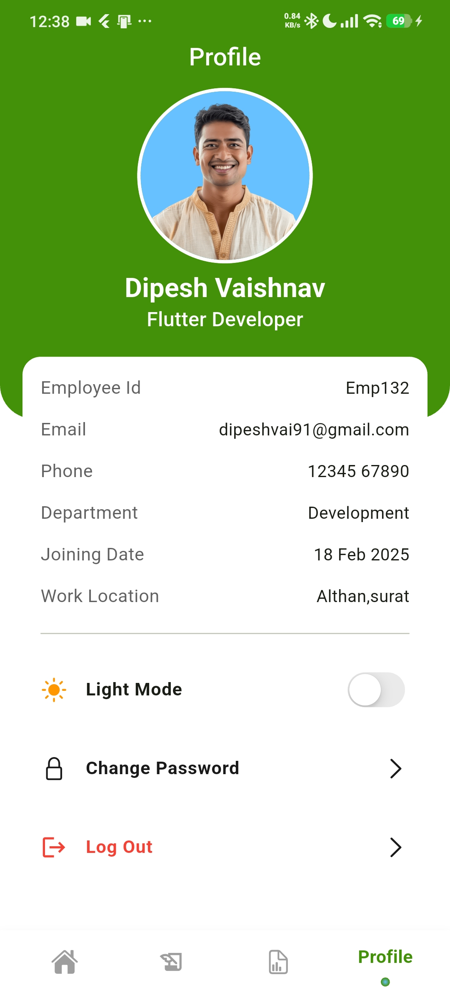

<div align="center">

# 📍 User Tracker — Smart Attendance & Geofenced Check-In

A Flutter attendance-tracking app with geofenced + WiFi-validated check-in,
break tracking, daily/weekly/monthly reports, and local push notifications —
backed by Supabase.


</div>

---

## 📸 Screenshots

| Login                                | Home — Checked In                                        | Break in progress                                | Daily Report                                       |
|--------------------------------------|----------------------------------------------------------|--------------------------------------------------|----------------------------------------------------|
|  |  |  |  |

| Monthly Report (chart)                                 | History                                  | Profile                                  | Dark mode                                    |
|--------------------------------------------------------|------------------------------------------|------------------------------------------|----------------------------------------------|
|  |  |  |  |

> 🎥 A 10-15s screen recording of login → punch in → break → punch out → daily
> report, converted to a GIF and placed at `docs/screenshots/demo.gif`, is the
> single highest-impact thing you can add here — recruiters skim READMEs,
> they rarely read them, and a moving demo is what actually gets looked at.

## ✨ Features

- **Email/password authentication** via Supabase Auth, with signup, login,
  and form validation.
- **Geofenced check-in** — validates the user is within a configurable
  radius of the office's GPS coordinates.
- **WiFi BSSID validation** — as a secondary signal alongside GPS, checks
  the connected network's BSSID against an allow-list.
- **Punch in / punch out** with automatic notification reminders.
- **Break tracking** — lunch, tea, and other break types, each with running
  duration and automatic total-break-time accumulation.
- **Daily, weekly, and monthly reports** with bar/pie chart visualizations
  (`fl_chart`).
- **Local push notifications** — check-in reminders and break-duration
  alerts via `flutter_local_notifications`, timezone-aware.
- **Light / dark theme**, persisted across app restarts.
- **Profile management** — avatar upload and profile editing backed by
  Supabase Storage.

## 🧱 Tech Stack

| Layer             | Choice                                          | Why                                                                                 |
|-------------------|-------------------------------------------------|-------------------------------------------------------------------------------------|
| Framework         | Flutter (Dart)                                  | Cross-platform, single codebase for Android/iOS                                     |
| State management  | `flutter_riverpod`                              | Compile-safe DI + reactive state without `BuildContext` lookups                     |
| Backend           | Supabase (Postgres + Auth + Storage + Realtime) | Managed Postgres with built-in auth, row-level security, and realtime subscriptions |
| Local persistence | `shared_preferences`                            | Lightweight key-value storage for theme/session flags                               |
| Notifications     | `flutter_local_notifications` + `timezone`      | Schedule-aware local reminders without a push backend                               |
| Charts            | `fl_chart`                                      | Lightweight, customizable charts for attendance reports                             |
| Responsive UI     | `flutter_screenutil`                            | Consistent scaling across device sizes                                              |
| Location          | `geolocator`                                    | GPS-based geofence validation                                                       |
| Network info      | `network_info_plus`                             | Reads the connected WiFi BSSID for office-network validation                        |
| Secrets           | `flutter_dotenv`                                | Keeps Supabase keys and office geofence config out of source control                |

## 📁 Folder Structure

```
lib/
├── core/
│   ├── consts/          # AppString, AppColors, AppEnums
│   ├── navigation/       # Bottom nav + main navigation shell
│   ├── themes/            # AppThemeData, box decorations, text theme
│   ├── utils/               # Date/time helpers, validators, geofence/WiFi check
│   └── widgets/               # AppButton, InputField, AppLoading, shared widgets
│
├── data/
│   ├── models/            # AttendanceModel, ProfileModel, BreakModel
│   └── services/            # AttendanceServices, AuthService, ProfileService,
│                              NotificationService — talk to Supabase directly
│
├── features/
│   ├── auth/                # login_screen.dart, signup_screen.dart
│   ├── homeScreen/            # Home tab: status, breaks, today overview
│   ├── historyScreen/           # Attendance history list
│   ├── reportScreen/              # Daily / weekly / monthly reports + charts
│   └── profileScreen/               # Profile view/edit
│
├── providers/               # Riverpod providers (services + UI state)
└── main.dart
```

> This reflects the structure as it exists today. A migration toward a
> repository/domain layer and snake_case feature folder names is planned —
> see the project's implementation notes for the rationale and step-by-step
> plan if you want to take that on later.

## 🔄 State Management

[Riverpod](https://riverpod.dev) is used throughout:

- `Provider` — exposes stateless services (`attendanceProvider`,
  `profileProvider`).
- `StreamProvider.family` — exposes live Supabase realtime streams scoped
  to a specific day/month.
- `AsyncNotifier` — owns mutable UI state, e.g. `ThemeModeNotifier` for
  persisted light/dark mode.

## 🚀 Getting Started

### Prerequisites

- Flutter SDK
- A free [Supabase](https://supabase.com) project

### Installation

```bash
git clone https://github.com/OWNER/user_tracker.git
cd user_tracker
flutter pub get
```

### Configuration

Create `assets/.env` (this file is git-ignored and must never be committed)
with your own Supabase project's values:

```env
supabaseUrl=https://your-project-ref.supabase.co
supabaseAnonKey=your-public-anon-key
wifiBSSID=aa:bb:cc:dd:ee:ff,11:22:33:44:55:66
officeLat=37.422000
officeLng=-122.084000
```

`supabaseAnonKey` is the public/anon key (safe for client apps when paired
with Postgres Row Level Security). `wifiBSSID`, `officeLat`, and `officeLng`
configure the geofence/WiFi check and should be your own office's values.

### Database schema

You'll need an `attendance_logs` table and a `profiles` table in your
Supabase project, with Row Level Security enabled so a user can only
read/write their own rows (`auth.uid() = user_id`).

### Run

```bash
flutter run
```

## 📬 Contact

Built by **Dipesh**. Open an issue for bugs/feature requests.

______________________